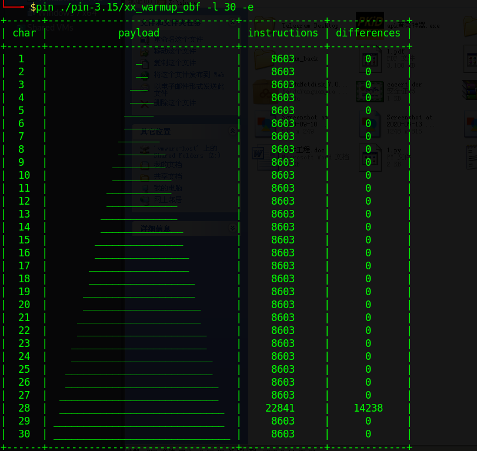
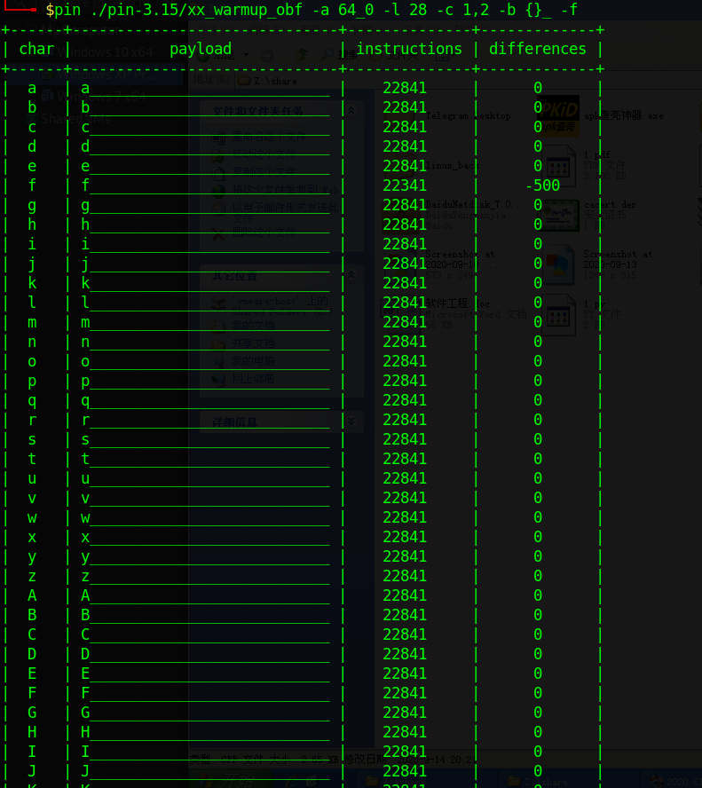
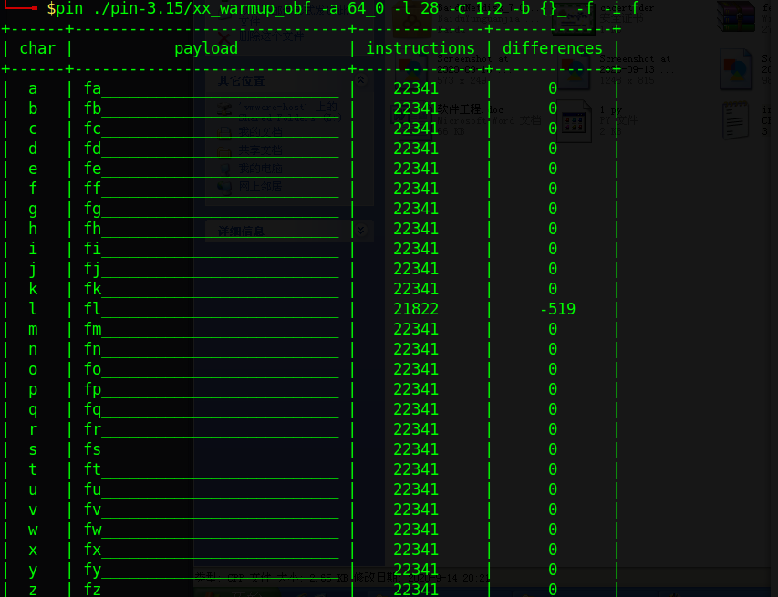
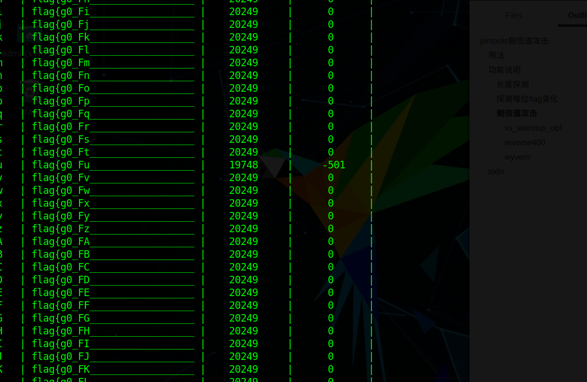
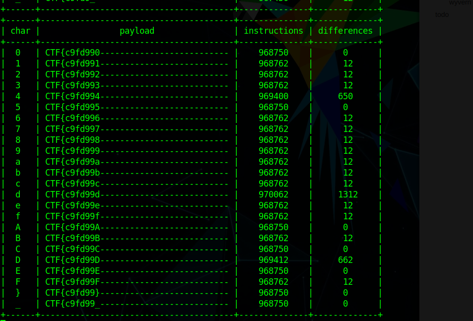
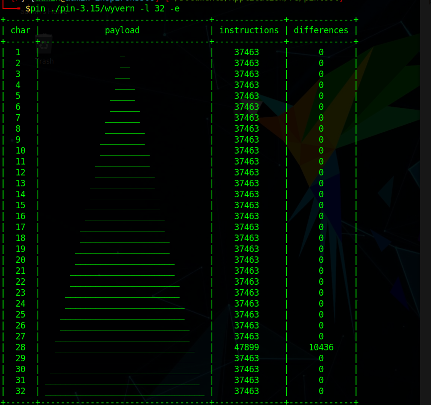
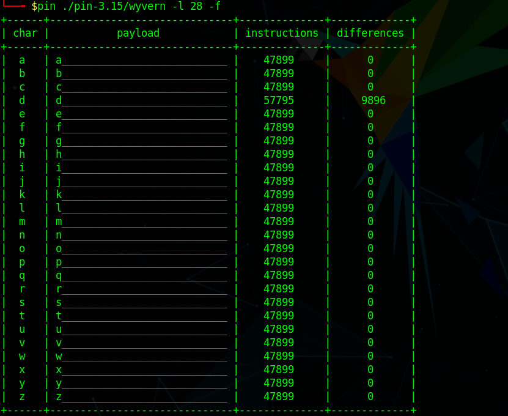
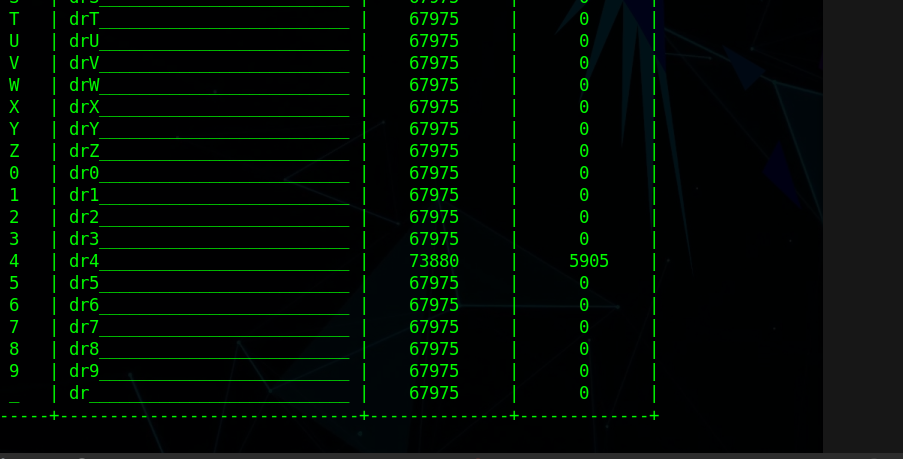

# pintools侧信道攻击

这篇文章花了很多时间去做测试，去做优化，代码层面，由于一直想用设计模式，导致进度很慢，最终也没弄好设计模式，还有就是pintools的稳定性，以及效率问题。


- 稳定性，默认的pintools指令计数不稳，每次运行的时候变化较大，有概率爆破出错误的flag，导致需要重新启动，具体原因，我没有去追踪pintools的插桩，而是通过修改pintools的计数方式来实现的。 说来也是运气，因为要解决一道pie的题目，修改了pintools代码，发觉原来的测试更稳定了， 具体就是获取当前指令，elf文件0x7f开头跟0xf7开头的指令略过，只插桩用户空间，速度快多了，并且稳定多了

- IO读写文件，这里我们可以用stdout流方式直接输出，但是有个问题，如果我们要考虑多进程的话，如何提高效率，因为pintools在爆破每位flag的时候，每个字母之间是相互不影响的，所以我们可以采用多进程方式进行爆破


**首先需要修改config.py里的DIRECTORY，运用pwd即可获得当前目录**
**首先需要修改config.py里的DIRECTORY，运用pwd即可获得当前目录**
**首先需要修改config.py里的DIRECTORY，运用pwd即可获得当前目录**


## 用法

- -l 指定长度
- -e 学习长度
- -f 探测第一位的变化
- -a 指定地址插桩
  - 支持pie保护，只给后1.5个字节即可，例如0xA40
  - 非pie保护输入完整地址， 0x400A40
- -i 指定输入的数据
- -c 指定输入的类型，比如字母大小写，数字
- -b 指定额外输入的符号
- -s 指定长度替换的单位
- -d 指定方式
  - min 取每部分指令最小的
  - max 取每部分指定最大的
  - =\> 1 取差异大于1的
  - <= 1 取差异小于1的
  - == 1 取差异==1的
  - != 1 取差异 !=1的  
  - 默认取存在差异的


## 功能说明

### 长度探测

-e 参数 指定学习

-l 指定学习的长度，这里指定为30

-a 指定文件平台

```python
python pintool.py xx_warmup_obf -e -l 30
```




### 探测每位flag变化

```bash
python pintool.py xx_warmup_obf -l 28 -c 1,2 -b {}_ -f
```



指定平台，指定长度，然后指定输入类型，额外添加字符， -f进行探测，这里我已经知道第一位为f，所以可以猜测在这里输入正确的flag每一位后，为最少字符的即为正确的flag


尝试第二位

```bash
python pintool.py xx_warmup_obf -l 28 -c 1,2 -b {}_ -i f -f
```

首先指定输入为f，不用从头开始爆破，



可以看到第二位也是一样的，最小的即为正确的flag，那就可以开始进行爆破了


### 侧信道攻击


#### xx_warmup_obf

```bash
python pintool.py xx_warmup_obf -l 28 -c 1,2,3 -b {}_  -i flag{
```




这里不再进行等待，时间过去后就能拿到flag了


#### reverse400

```bash
python pintool.py -l 37 -c 4 -i CTF{ -b }_ -s - -d ">= 1300"
```

至于长度跟已知的flag，这个我是根据例子来的，已知正确flag了，发觉规律是1300以上的为正确flag，设置-d即可




#### wyvern

这里探测到长度为28，用块级插桩出错了，探测到28位

```bash
python pintool.py wyvern -e -l 32
```



然后探测规律




最终发觉当输入正确flag的时候，指令会变化，所以只需要使用默认设置即可

```bash
python pintool.py wyvern -l 28 -c 1,2,3 -b _
```



不进行后续测试了，因为确实是可以的


